# [📈 Live Status](https://ageg-status.github.io): <!--live status--> **🟧 Partial outage**

This repository contains the open-source uptime monitor and status page for [ageg-status](https://ageg-status.github.io), powered by [Upptime](https://github.com/upptime/upptime).

With [Upptime](https://upptime.js.org), you can get your own unlimited and free uptime monitor and status page, powered entirely by a GitHub repository. We use [Issues](https://github.com/ageg-status/ageg-status.github.io/issues) as incident reports, [Actions](https://github.com/ageg-status/ageg-status.github.io/actions) as uptime monitors, and [Pages](https://ageg-status.github.io) for the status page.

<!--start: status pages-->
<!-- This summary is generated by Upptime (https://github.com/upptime/upptime) -->
<!-- Do not edit this manually, your changes will be overwritten -->
<!-- prettier-ignore -->
| URL | Status | History | Response Time | Uptime |
| --- | ------ | ------- | ------------- | ------ |
|  [UdeS website (prod)](https://www.usherbrooke.ca/) | 🟩 Up | [ude-s-website-prod.yml](https://github.com/ageg-status/ageg-status.github.io/commits/HEAD/history/ude-s-website-prod.yml) | 

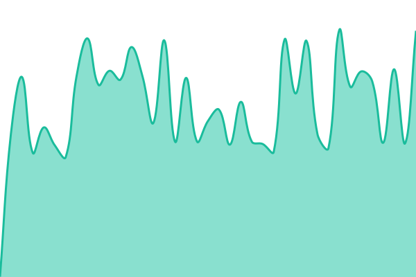 810ms
     
 | 

<a href="https://ageg-status.github.io/history/ude-s-website-prod">83.19%</a>
    

|  [AGEG website (prod)](https://www.ageg.ca/) | 🟥 Down | [ageg-website-prod.yml](https://github.com/ageg-status/ageg-status.github.io/commits/HEAD/history/ageg-website-prod.yml) | 

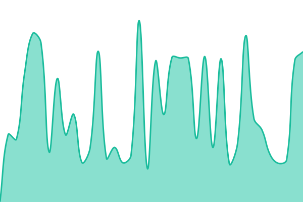 315ms
     
 | 

<a href="https://ageg-status.github.io/history/ageg-website-prod">89.24%</a>
    

|  [AGEG website (redirect)](https://ageg.ca/) | 🟥 Down | [ageg-website-redirect.yml](https://github.com/ageg-status/ageg-status.github.io/commits/HEAD/history/ageg-website-redirect.yml) | 

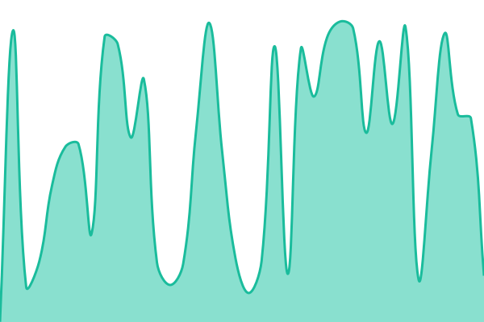 908ms
     
 | 

<a href="https://ageg-status.github.io/history/ageg-website-redirect">89.25%</a>
    

|  [Vote (prod)](https://vote.ageg.ca/) | 🟥 Down | [vote-prod.yml](https://github.com/ageg-status/ageg-status.github.io/commits/HEAD/history/vote-prod.yml) | 

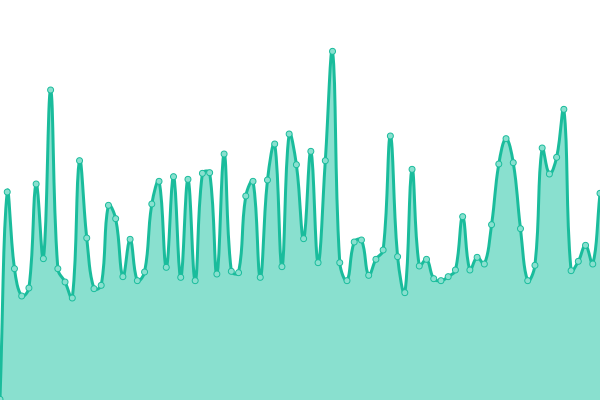 0ms
     
 | 

<a href="https://ageg-status.github.io/history/vote-prod">0.00%</a>
    

|  [Integrations (prod)](https://integrations.ageg.ca/) | 🟥 Down | [integrations-prod.yml](https://github.com/ageg-status/ageg-status.github.io/commits/HEAD/history/integrations-prod.yml) | 

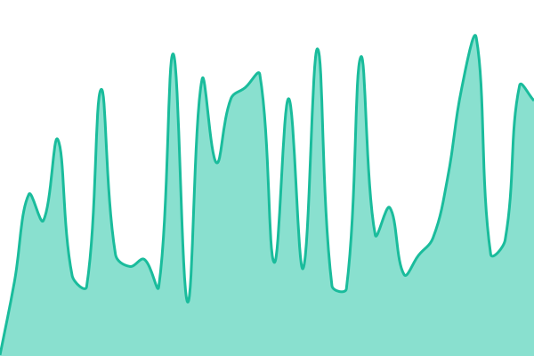 164ms
     
 | 

<a href="https://ageg-status.github.io/history/integrations-prod">88.18%</a>
    

|  [Integration (redirect)](https://integration.ageg.ca/) | 🟥 Down | [integration-redirect.yml](https://github.com/ageg-status/ageg-status.github.io/commits/HEAD/history/integration-redirect.yml) | 

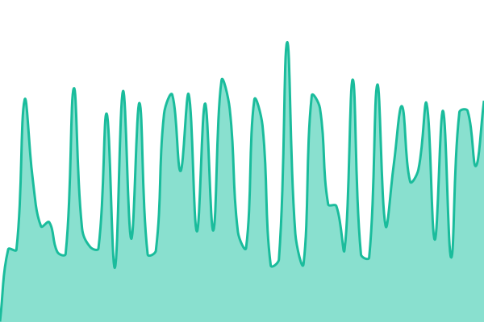 292ms
     
 | 

<a href="https://ageg-status.github.io/history/integration-redirect">57.24%</a>
    

|  [Integs (redirect)](https://integs.ageg.ca/) | 🟥 Down | [integs-redirect.yml](https://github.com/ageg-status/ageg-status.github.io/commits/HEAD/history/integs-redirect.yml) | 

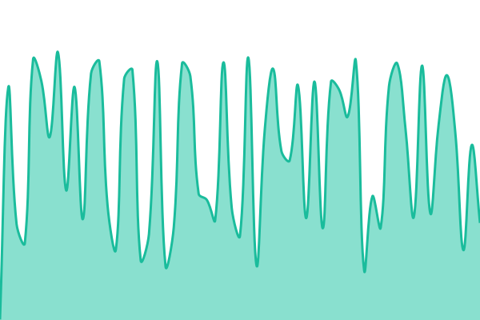 296ms
     
 | 

<a href="https://ageg-status.github.io/history/integs-redirect">55.81%</a>
    

|  [Integ (redirect)](https://integ.ageg.ca/) | 🟥 Down | [integ-redirect.yml](https://github.com/ageg-status/ageg-status.github.io/commits/HEAD/history/integ-redirect.yml) | 

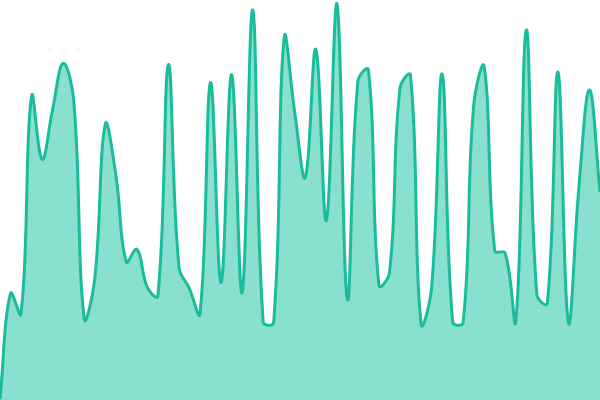 294ms
     
 | 

<a href="https://ageg-status.github.io/history/integ-redirect">57.39%</a>
    

|  [Okto (prod)](https://okto.ageg.ca/) | 🟥 Down | [okto-prod.yml](https://github.com/ageg-status/ageg-status.github.io/commits/HEAD/history/okto-prod.yml) | 

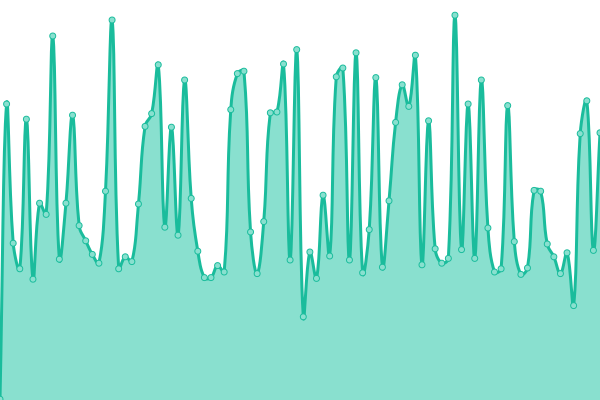 0ms
     
 | 

<a href="https://ageg-status.github.io/history/okto-prod">0.00%</a>
    

|  [Oktoberfest (prod)](https://oktoberfest.ageg.ca/) | 🟥 Down | [oktoberfest-prod.yml](https://github.com/ageg-status/ageg-status.github.io/commits/HEAD/history/oktoberfest-prod.yml) | 

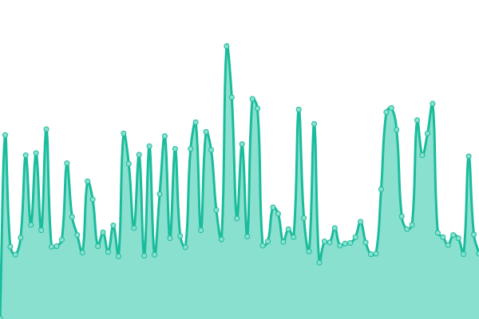 0ms
     
 | 

<a href="https://ageg-status.github.io/history/oktoberfest-prod">0.00%</a>
    

|  [okto-ageg (gitlab page)](https://okto-ageg.gitlab.io/) | 🟩 Up | [okto-ageg-gitlab-page.yml](https://github.com/ageg-status/ageg-status.github.io/commits/HEAD/history/okto-ageg-gitlab-page.yml) | 

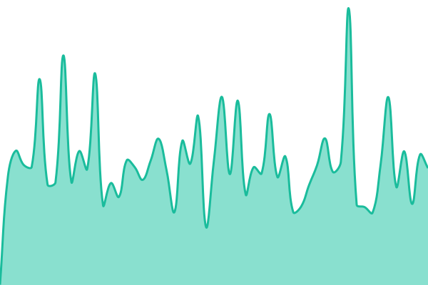 336ms
     
 | 

<a href="https://ageg-status.github.io/history/okto-ageg-gitlab-page">97.27%</a>
    

|  [okto-ageg (staging)](https://okto-ageg-staging.gitlab.io/) | 🟩 Up | [okto-ageg-staging.yml](https://github.com/ageg-status/ageg-status.github.io/commits/HEAD/history/okto-ageg-staging.yml) | 

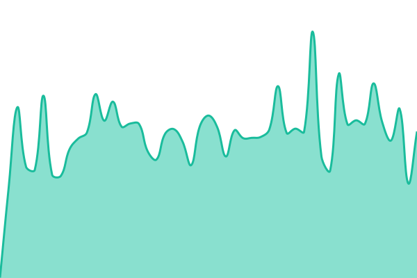 333ms
     
 | 

<a href="https://ageg-status.github.io/history/okto-ageg-staging">98.93%</a>
    

|  [2 Minutes de génie (prod)](https://2mdg.ageg.ca/) | 🟩 Up | [2-minutes-de-genie-prod.yml](https://github.com/ageg-status/ageg-status.github.io/commits/HEAD/history/2-minutes-de-genie-prod.yml) | 

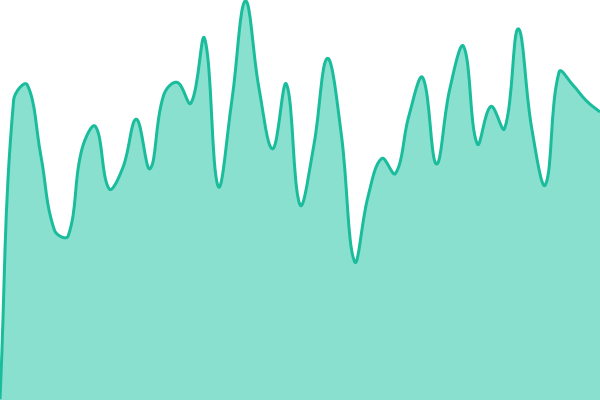 337ms
     
 | 

<a href="https://ageg-status.github.io/history/2-minutes-de-genie-prod">93.07%</a>
    

|  [2 Minutes de génie (gitlab page)](https://2mdg.gitlab.io/) | 🟩 Up | [2-minutes-de-genie-gitlab-page.yml](https://github.com/ageg-status/ageg-status.github.io/commits/HEAD/history/2-minutes-de-genie-gitlab-page.yml) | 

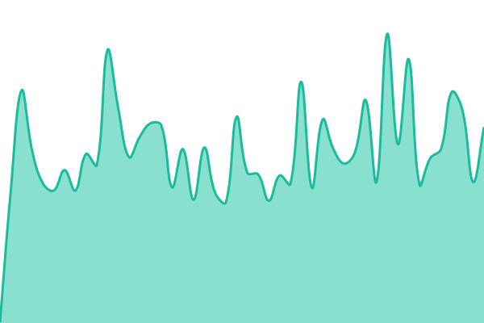 318ms
     
 | 

<a href="https://ageg-status.github.io/history/2-minutes-de-genie-gitlab-page">94.15%</a>
    

|  [2 Minutes de génie (staging)](https://2mdgstaging.gitlab.io/) | 🟨 Degraded | [2-minutes-de-genie-staging.yml](https://github.com/ageg-status/ageg-status.github.io/commits/HEAD/history/2-minutes-de-genie-staging.yml) | 

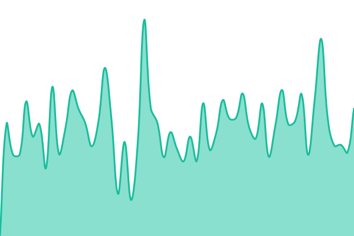 352ms
     
 | 

<a href="https://ageg-status.github.io/history/2-minutes-de-genie-staging">89.76%</a>
    

|  [Soutien à la vie étudiante (prod)](https://www.usherbrooke.ca/etudiants/vie-etudiante/soutien-a-la-vie-etudiante) | 🟥 Down | [soutien-a-la-vie-etudiante-prod.yml](https://github.com/ageg-status/ageg-status.github.io/commits/HEAD/history/soutien-a-la-vie-etudiante-prod.yml) | 

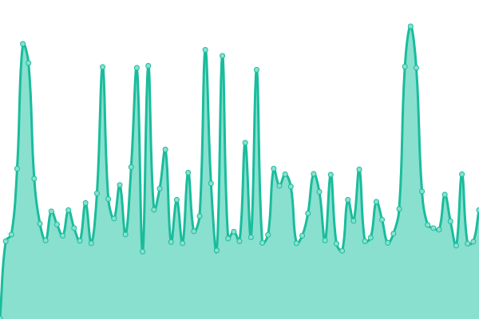 0ms
     
 | 

<a href="https://ageg-status.github.io/history/soutien-a-la-vie-etudiante-prod">0.00%</a>
    

|  [Sécurité UdeS (prod)](https://www.usherbrooke.ca/smsp/securite) | 🟥 Down | [securite-ude-s-prod.yml](https://github.com/ageg-status/ageg-status.github.io/commits/HEAD/history/securite-ude-s-prod.yml) | 

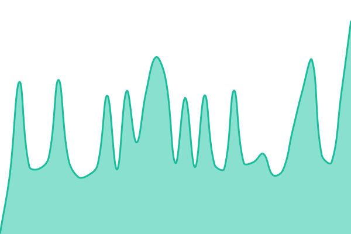 386ms
     
 | 

<a href="https://ageg-status.github.io/history/securite-ude-s-prod">0.00%</a>
    

|  [Sécurité UdeS (redirect)](https://www.usherbrooke.ca/immeubles/la-securite/) | 🟥 Down | [securite-ude-s-redirect.yml](https://github.com/ageg-status/ageg-status.github.io/commits/HEAD/history/securite-ude-s-redirect.yml) | 

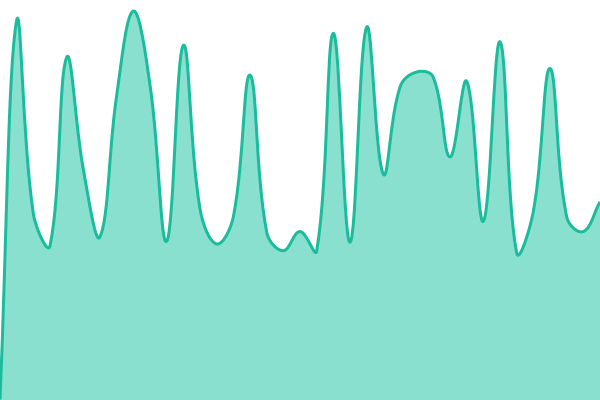 650ms
     
 | 

<a href="https://ageg-status.github.io/history/securite-ude-s-redirect">0.00%</a>
    

|  [Formulaire activités sécurité UdeS (prod)](https://www.usherbrooke.ca/smsp/service-a-la-clientele/activites-sur-les-campus) | 🟩 Up | [formulaire-activites-securite-ude-s-prod.yml](https://github.com/ageg-status/ageg-status.github.io/commits/HEAD/history/formulaire-activites-securite-ude-s-prod.yml) | 

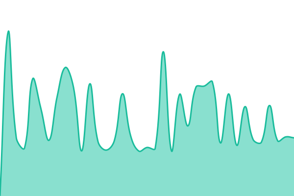 747ms
     
 | 

<a href="https://ageg-status.github.io/history/formulaire-activites-securite-ude-s-prod">94.39%</a>
    

|  [Formulaire activités sécurité UdeS (redirect)](https://www.usherbrooke.ca/immeubles/la-securite/formulaires/) | 🟩 Up | [formulaire-activites-securite-ude-s-redirect.yml](https://github.com/ageg-status/ageg-status.github.io/commits/HEAD/history/formulaire-activites-securite-ude-s-redirect.yml) | 

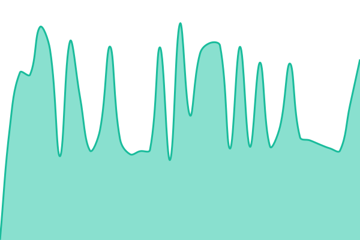 884ms
     
 | 

<a href="https://ageg-status.github.io/history/formulaire-activites-securite-ude-s-redirect">95.01%</a>
    

<!--end: status pages-->

[**Visit our status website →**](https://ageg-status.github.io)

## 📄 License

- Powered by: [Upptime](https://github.com/upptime/upptime)
- Code: [MIT](./LICENSE) © [ageg-status](https://ageg-status.github.io)
- Data in the `./history` directory: [Open Database License](https://opendatacommons.org/licenses/odbl/1-0/)
